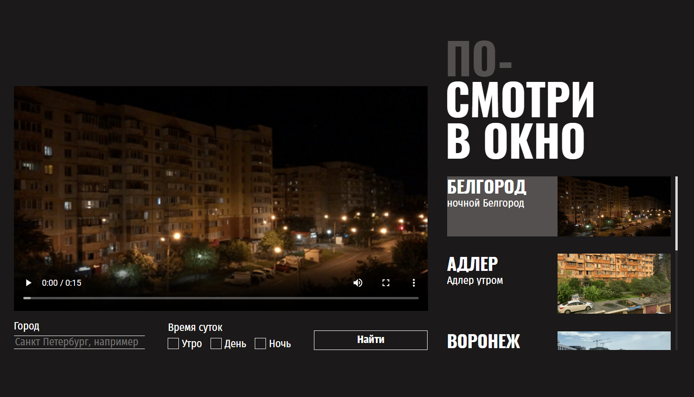
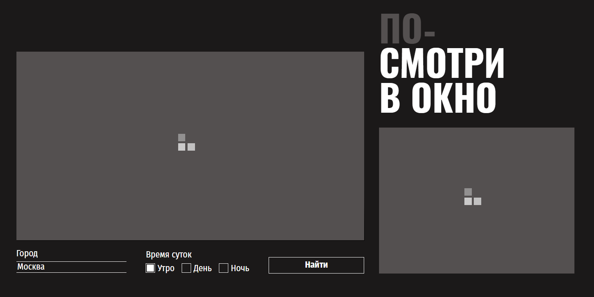
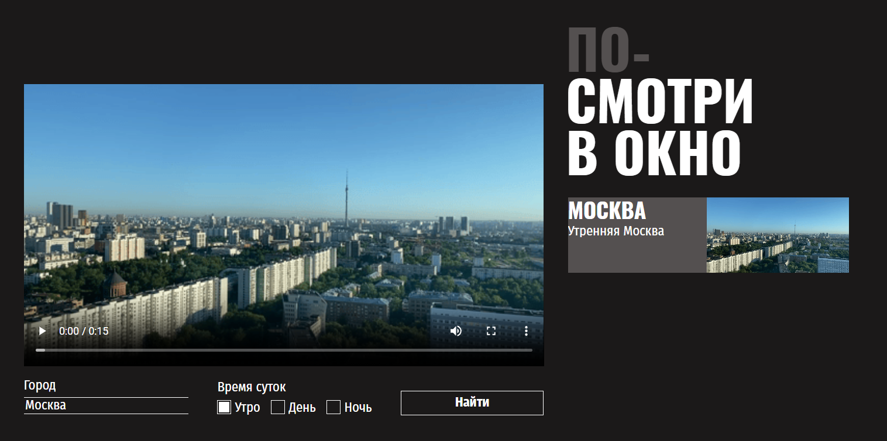
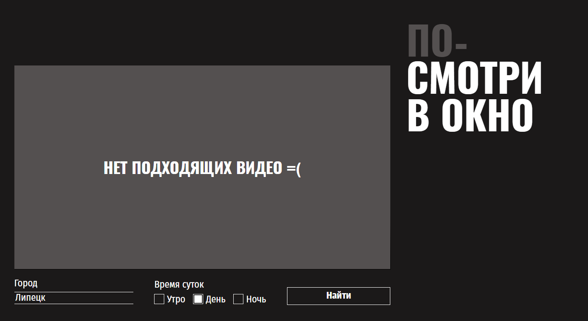

# Проект ПОСМОТРИ В ОКНО🌏

[Ссылка на проект в GitHub](https://github.com/HelenVirtanen/posmotri-v-okno-fd)
[Посмотреть на GitHub Pages](https://helenvirtanen.github.io/posmotri-v-okno-fd/)

## 📖 Описание проекта: 
Проект "Посмотри в окно" носит развлекательный и познавательный характер. 
**__Основная идея__** - посмотреть на вид из окна разных **городов** в разное **время суток**.

### 🧩 Элементы интерфейса приложения:
* __текущее видео__, в котором показывается вид на город;
* __форма поиска__ под видео, где можно набрать название города и выбрать с помощью чекбокса утро, день, вечер и нажать кнопку "Найти";
* __название проекта__ в верхнем правом углу;
* __список видео__ под названием проекта, которые подходящит по критериям поискового запроса;
* __кнопка "Посмотреть еще"__, которая появляется если видео больше 5 и подгружает при нажатии 5 видео.

## 🖼️ Скриншоты
### Главная


### Лоадер при поиске


### Лоадер при поиске


### Успешный результат поиска


### Ошибка поиска



## ⚙️ Суть работы скрипта:
* при загрузке страницы получает данные из внешнего источника, отрисовывает 5 карточек с видео и кнопку, чтобы подгрузить доп. карточки; 
* подставляет адрес первого из загруженных роликов в тег video внутри крупного блока на странице;
* отслеживает клик по карточкам и меняет текущее видео в зависимости от выбранной карточки;
* следит за отправкой формы. После отправки ищет в базе данных совпадения по введённым параметрам и перерисовывает страницу с данными, полученными из нового запроса;
* в случае ошибок на место блока с видео подставляется блок с сообщением об ошибке. 
* во время поиска в блоки с видео и карточками подставляются прелоадеры, отображающие анимацию процесса загрузки.

## 🛠️ Применяемые технологии
* HTML
* CSS
* JS

## 🚀 Установка и запуск
**1. Клонировать репозиторий**
```git clone https://github.com/HelenVirtanen/posmotri-v-okno-fd.git```

**2. Запустить**
Открыть в VS Code -> нажать Go Live (для этого должен быть установлен плагин Live Server)
